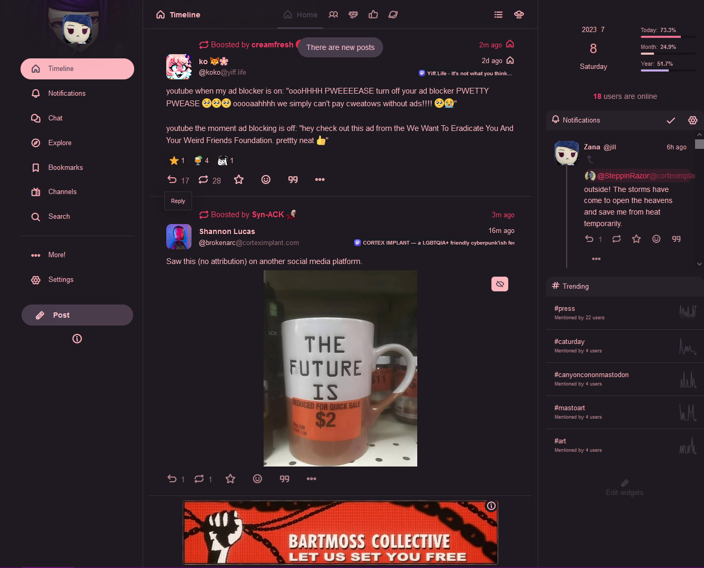
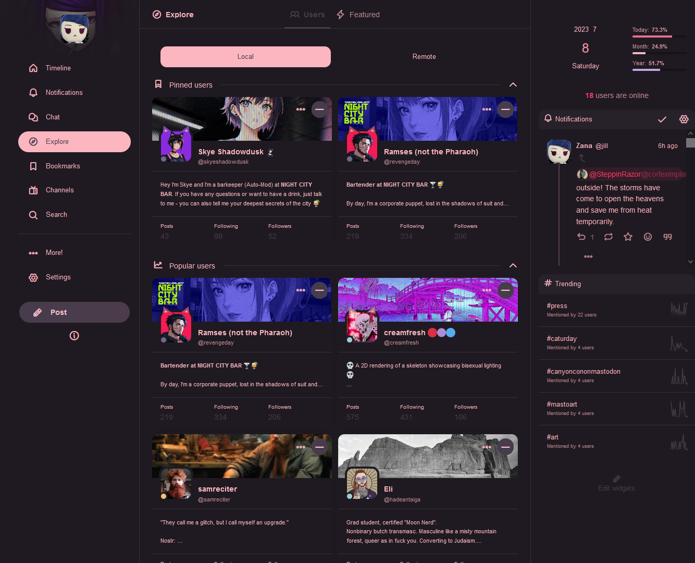

# Karmotrine Dream Calckey Theme

A dark-mode theme for Calckey/Misskey made with pink and slight purple colours

I originally wanted to base this off of the VA-11 Hall-A UI. That did not work as good as expected, but I used that as a base to make a theme I'm mostly happy with.
I tried to make it as readable as possible, but there's the occasional UI element that's a little hard to read that is not so easy to fix as I hoped. 

## Installing

1. Open your Calckey instance
2. Navigate to Settings > Themes > Install a theme
3. Paste code
4. Press Install

  
Code

  
      {
        id: '03539279-f1a0-4d7c-9732-2cce7cb39235',
        base: 'dark',
        desc: 'A dark theme somewhat originally based on the VA-11 Hall-A UI colours. Not so much in the end result.',
        name: 'Karmotrine Dream',
        props: {
          bg: '#1f1a21',
          fg: '#FCB6C0',
          cwBg: '@accent',
          cwFg: '@fgOnAccent',
          link: '@mention',
          badge: '@mention',
          navBg: '#1f1a2d',
          panel: '@bg',
          popup: '@navBg',
          accent: ':lighten<15<@bg',
          renote: '@mention',
          hashtag: '@mention',
          mention: '#F03B67',
          buttonBg: ':lighten<5<@bg',
          accentedBg: '#FCB6C0',
          fgOnAccent: '#FEC5D2',
          infoWarnBg: '@accentedBg',
          infoWarnFg: 'black',
          swutchOnBg: '@accent',
          swutchOnFg: '@fg',
          swutchOffFg: '#7b7b7b',
          fgHighlighted: ':darken<5<@fg',
        },
        author: '@jill@nightcity.bar',
      }

## Screenshots

  
Screenshot of timeline with Karmotrine Dream theme

  

  
Screenshot of explore page with Karmotrine Dream theme

  

